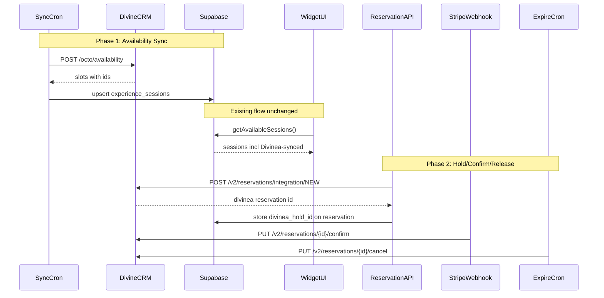

# Divinea Integration Plan

Integrate Divinea Wine Suite (OCTO API) with Traverum to sync availability and manage bookings. Phased approach: Phase 1 is read-only availability sync, Phase 2 tests holds and booking lifecycle — both against Divinea staging.

**Status:** Planned — to be implemented later.

---

## Architecture



---

## Phase 1: Read-only availability sync

Goal: Fetch slots from Divinea staging and see them as `experience_sessions` in Traverum. No writes to Divinea. No changes to the booking flow.

### 1a. Environment variables

Add to `apps/widget/.env.local`:

```
DIVINEA_API_KEY=<your-api-key>
DIVINEA_API_SECRET=<your-secret>
DIVINEA_WINERY_ID=<your-winery-id>
DIVINEA_API_BASE_URL=https://api-crm-staging.divinea.com/api
```

### 1b. Divinea client module

Create `apps/widget/src/lib/divinea.ts` following the same pattern as `apps/widget/src/lib/stripe.ts`:

- **Config** from env vars (`DIVINEA_API_KEY`, `DIVINEA_WINERY_ID`, `DIVINEA_API_BASE_URL`)
- **Typed interfaces** for OCTO request/response shapes (`AvailabilityRequest`, `OCTOAvailabilityDTO`, `OCTOAvailabilityCalendarDTO`)
- **Functions (Phase 1, read-only):**
  - `getAvailabilityCalendar(productId, optionId, dateRange)` — POST `/octo/availability/calendar`
  - `getAvailabilitySlots(productId, optionId, dateRange)` — POST `/octo/availability`
  - `getSupplier()` — GET `/octo/supplier` (for testing connectivity)
- **Functions (Phase 2, added later):**
  - `createReservationHold(...)` — POST `/v2/reservations/integration/NEW`
  - `confirmReservation(reservationId)` — PUT `/v2/reservations/{id}/confirm`
  - `cancelReservation(reservationId)` — PUT `/v2/reservations/{id}/cancel`

All requests send headers: `APIKey: <key>`, `X-DWS-WINERY: <wineryId>`, `Content-Type: application/json`.

### 1c. Database migration

New migration file in `apps/dashboard/supabase/migrations/`:

- **`experiences` table:** Add `divinea_product_id` (text, nullable), `divinea_option_id` (text, nullable), `calendar_source` (text, default `'traverum'`, check constraint: `'traverum'` or `'divinea'`)
- **`experience_sessions` table:** Add `divinea_slot_id` (text, nullable) to link each synced session to its Divinea availability ID
- **`reservations` table:** Add `divinea_reservation_id` (text, nullable) for Phase 2

Regenerate types: `npx supabase gen types typescript --project-id <id> > apps/widget/src/lib/supabase/types.ts`

### 1d. Test API route (manual trigger)

Create `apps/widget/src/app/api/divinea/test-availability/route.ts`:

- Protected by `CRON_SECRET` (same pattern as existing crons)
- Accepts query params: `productId`, `optionId`, `days` (default 30)
- Calls `getAvailabilitySlots()` from the Divinea client
- Returns raw Divinea response as JSON (for inspection)
- No DB writes — pure read-only test

### 1e. Availability sync route

Create `apps/widget/src/app/api/cron/sync-divinea/route.ts`:

- Protected by `CRON_SECRET`
- Query all experiences where `calendar_source = 'divinea'` and `divinea_product_id` is not null
- For each: call `getAvailabilitySlots(productId, optionId, next 90 days)`
- **Upsert** into `experience_sessions`:
  - Match on `divinea_slot_id` (if exists, update; if new, insert)
  - Map: `localDateTimeStart` -> `session_date` + `start_time`, `vacancies` -> `spots_available` / `spots_total`, `status` -> `session_status` (AVAILABLE/FREESALE -> `'available'`, SOLD_OUT/CLOSED -> skip or `'booked'`)
  - Store `id` from Divinea response as `divinea_slot_id`
- **Cleanup:** sessions with `divinea_slot_id` that no longer appear in Divinea response -> delete (or mark cancelled) if `session_status = 'available'`
- Return summary: `{ synced: N, created: N, updated: N, removed: N }`
- Add to `vercel.json` crons later (e.g. every 15 min) — for now, manual trigger only

### 1f. Set up a test experience

- Pick (or create) one test experience in the dashboard
- Set `calendar_source = 'divinea'`, `divinea_product_id`, `divinea_option_id` (get these from `GET /octo/supplier` or from the Divinea dashboard)
- Run the sync manually via `GET /api/cron/sync-divinea?authorization=Bearer <CRON_SECRET>`
- Verify: sessions appear in the widget for that experience

---

## Phase 2: Holds and booking lifecycle (staging only)

Goal: Test full hold -> confirm -> release flow against Divinea staging. Wire into existing Traverum booking flow.

### 2a. Divinea client — reservation functions

Add to `apps/widget/src/lib/divinea.ts`:

- `createReservationHold(params)` — POST `/v2/reservations/integration/NEW` with:
  - `experienceId` (Divinea UUID), `date`, `time`, `guestCount`, `state: 'draft'`
  - Guest contact info (name, email, phone)
  - Returns: `reservationId` (Divinea's)
- `confirmReservation(reservationId)` — PUT `/v2/reservations/{id}/confirm`
- `cancelReservation(reservationId)` — PUT `/v2/reservations/{id}/cancel`

### 2b. Test API route for holds

Create `apps/widget/src/app/api/divinea/test-hold/route.ts`:

- Protected by `CRON_SECRET`
- Accepts: `slotId`, test guest details
- Calls `createReservationHold()`, then immediately `cancelReservation()` (so we never leave a real hold)
- Returns both responses for inspection
- This lets us verify the hold/cancel cycle works without affecting anything

### 2c. Wire into reservation creation

In `apps/widget/src/app/api/reservations/route.ts`:

- After validating the session is available (existing code around line 171)
- Check: does this experience have `calendar_source = 'divinea'`?
- If yes: load the session's `divinea_slot_id`, call `createReservationHold()` with guest details
- Store the returned Divinea reservation ID as `divinea_reservation_id` on the Traverum reservation
- If the hold fails (slot taken in Divinea): return 400 "Slot no longer available"
- Existing flow continues: create reservation, payment link, etc.

### 2d. Wire into Stripe webhook (confirm on payment)

In `apps/widget/src/app/api/webhooks/stripe/route.ts`:

- In `createBookingFromPayment` (around line 437, after booking insert):
  - Check: does the reservation have `divinea_reservation_id`?
  - If yes: call `confirmReservation(divinea_reservation_id)`
  - Log success/failure; if failure, log error but do NOT block the booking (guest already paid — flag for manual review)

### 2e. Wire into expiry and cancellation

In `apps/widget/src/app/api/cron/expire-reservations/route.ts`:

- In both Part 1 (pending expired) and Part 2 (unpaid expired):
  - After releasing the session in DB, check `reservation.divinea_reservation_id`
  - If set: call `cancelReservation(divinea_reservation_id)`
  - Log result; continue on failure (don't block expiry)

In the Stripe webhook `handlePaymentFailed` (around line 219):
  - Same: if `reservation.divinea_reservation_id`, call `cancelReservation()`

In booking cancel routes (`apps/widget/src/app/api/bookings/[id]/cancel/route.ts` and `apps/widget/src/app/api/dashboard/bookings/[id]/cancel/route.ts`):
  - After refunding and releasing the session, if `divinea_reservation_id` is set, call `cancelReservation()`

### 2f. Dashboard: disable manual session management

For experiences with `calendar_source = 'divinea'`:

- Hide "Create Session" / "Delete Session" buttons
- Show a badge like "Synced from Divinea" on the sessions page
- This is in `apps/dashboard/src/pages/supplier/ExperienceSessions.tsx` and `apps/dashboard/src/pages/supplier/SupplierSessions.tsx`

---

## Key files touched

| File | Change |
|------|--------|
| `apps/widget/src/lib/divinea.ts` | **New** — Divinea API client |
| `apps/widget/src/app/api/divinea/test-availability/route.ts` | **New** — manual test endpoint |
| `apps/widget/src/app/api/divinea/test-hold/route.ts` | **New** — Phase 2 hold test |
| `apps/widget/src/app/api/cron/sync-divinea/route.ts` | **New** — availability sync cron |
| `apps/dashboard/supabase/migrations/...divinea.sql` | **New** — DB migration |
| `apps/widget/src/lib/supabase/types.ts` | Regenerated |
| `apps/widget/src/app/api/reservations/route.ts` | Phase 2: add Divinea hold on reserve |
| `apps/widget/src/app/api/webhooks/stripe/route.ts` | Phase 2: confirm Divinea on payment |
| `apps/widget/src/app/api/cron/expire-reservations/route.ts` | Phase 2: cancel Divinea on expiry |
| `apps/widget/src/app/api/bookings/[id]/cancel/route.ts` | Phase 2: cancel Divinea on booking cancel |
| `apps/widget/vercel.json` | Phase 2: add sync-divinea cron schedule |
| `apps/dashboard/src/pages/supplier/ExperienceSessions.tsx` | Phase 2: read-only for Divinea experiences |

---

## Testing strategy

- **Phase 1:** All calls to Divinea staging, read-only. No risk. Verify slots appear correctly in the widget.
- **Phase 2:** All calls to Divinea **staging** (not production). Use the test-hold endpoint first to verify create/cancel works. Then test full flow: reserve -> pay -> confirm (or expire -> cancel). Monitor staging calendar in Divinea to verify slots are held/released correctly.
- **Switch to production:** Only after staging tests pass — change `DIVINEA_API_BASE_URL` to `https://api-crm.divinea.com/api`.

---

## Todo checklist (when implementing)

- [ ] Add Divinea env vars to apps/widget/.env.local
- [ ] Create apps/widget/src/lib/divinea.ts with availability functions (getAvailabilityCalendar, getAvailabilitySlots, getSupplier)
- [ ] Create migration: add divinea_product_id, divinea_option_id, calendar_source to experiences; divinea_slot_id to experience_sessions; divinea_reservation_id to reservations
- [ ] Regenerate Supabase types after migration
- [ ] Create /api/divinea/test-availability route (read-only, returns raw Divinea response)
- [ ] Create /api/cron/sync-divinea route (fetch Divinea slots, upsert into experience_sessions)
- [ ] Set up one test experience with Divinea IDs, run sync, verify sessions appear in widget
- [ ] Add createReservationHold, confirmReservation, cancelReservation to divinea.ts
- [ ] Create /api/divinea/test-hold route (create + immediately cancel, verify cycle works)
- [ ] Wire Divinea hold into POST /api/reservations for Divinea-linked experiences
- [ ] Wire Divinea confirm into Stripe webhook createBookingFromPayment
- [ ] Wire Divinea cancel into expire-reservations cron and payment-failed handler
- [ ] Wire Divinea cancel into booking cancel routes
- [ ] Hide session create/delete for Divinea experiences in dashboard
