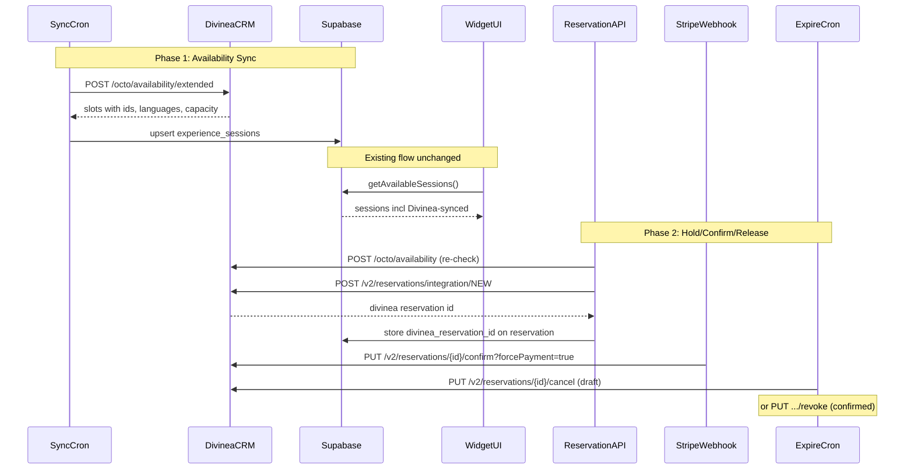

# Divinea Integration Plan

Integrate Divinea Wine Suite (OCTO API + Integration v2) with Traverum to sync availability and manage bookings. Phased approach: Phase 1 is read-only availability sync, Phase 2 is hold/confirm/release lifecycle — both against Divinea staging first.

**Status:** Planned — API access confirmed, testing connectivity.

**API Documentation:** `docs/context7/divinea-api-documentation.md`

---

## Architecture



---

## Authentication

Two headers on every request:

| Header | Value | Description |
|--------|-------|-------------|
| `APIKey` | env var `DIVINEA_API_KEY` | API key for authentication |
| `X-DWS-WINERY` | env var `DIVINEA_WINERY_ID` | Winery UUID — scopes requests |

No secret, no token pair. Just these two headers + `Content-Type: application/json`.

---

## Phase 1: Read-only availability sync

Goal: Fetch slots from Divinea staging and see them as `experience_sessions` in Traverum. No writes to Divinea. No changes to the booking flow. Guest sees Divinea availability in the widget calendar — indistinguishable from manually created sessions.

### 1a. Environment variables

Add to `apps/widget/.env.local`:

```
DIVINEA_API_KEY=<api-key>
DIVINEA_WINERY_ID=<winery-uuid>
DIVINEA_API_BASE_URL=https://api-crm-staging.divinea.com/api
```

Three vars. No secret needed.

### 1b. Database migration

New migration file in `apps/dashboard/supabase/migrations/`:

```sql
-- experiences table
ALTER TABLE experiences
  ADD COLUMN calendar_source text NOT NULL DEFAULT 'traverum'
    CHECK (calendar_source IN ('traverum', 'divinea')),
  ADD COLUMN divinea_product_id text,
  ADD COLUMN divinea_option_id text;

-- experience_sessions table
ALTER TABLE experience_sessions
  ADD COLUMN divinea_slot_id text;

CREATE UNIQUE INDEX idx_sessions_divinea_slot_id
  ON experience_sessions (divinea_slot_id)
  WHERE divinea_slot_id IS NOT NULL;

-- reservations table (for Phase 2, but migrate now to avoid a second migration)
ALTER TABLE reservations
  ADD COLUMN divinea_reservation_id text;
```

The unique partial index on `divinea_slot_id` prevents duplicate sync and makes upsert reliable.

Regenerate types: `npx supabase gen types typescript --project-id <id> > apps/widget/src/lib/supabase/types.ts`

### 1c. Divinea client module

Create `apps/widget/src/lib/divinea.ts` following the same pattern as `apps/widget/src/lib/stripe.ts`:

- **Config** from env vars (`DIVINEA_API_KEY`, `DIVINEA_WINERY_ID`, `DIVINEA_API_BASE_URL`)
- **Typed interfaces** for OCTO request/response shapes
- **Functions (Phase 1, read-only):**
  - `getSupplier()` — `GET /octo/supplier` (connectivity test)
  - `getAvailabilityCalendar(productId, optionId, dateRange)` — `POST /octo/availability/calendar` (which dates have slots)
  - `getAvailabilityExtended(productId, optionId, dateRange)` — `POST /octo/availability/extended` (full slot data with languages, capacity, rooms)

Key types:

```typescript
interface AvailabilityRequest {
  productId: string;
  optionId?: string;
  localDateStart: string;  // yyyy-MM-dd
  localDateEnd: string;    // yyyy-MM-dd
  availabilityIds?: string[];
}

interface DivineaSlot {
  id: string;
  day: string;             // yyyy-MM-dd
  startTime: string;       // ISO datetime
  endTime: string;         // ISO datetime
  active: boolean;
  availableSeats: number;
  occupiedCount: number;
  maxParties: number;
  enabledLanguages: string[];
  experience: { id: string; title: string; duration: number };
  room?: { id: string; name: string; capacity: number };
}
```

All requests include headers:
```typescript
{
  'APIKey': process.env.DIVINEA_API_KEY,
  'X-DWS-WINERY': process.env.DIVINEA_WINERY_ID,
  'Content-Type': 'application/json',
}
```

### 1d. Test API route (manual trigger)

Create `apps/widget/src/app/api/divinea/test-availability/route.ts`:

- Protected by `CRON_SECRET` (same pattern as existing crons)
- Accepts query params: `productId`, `optionId`, `days` (default 30)
- Calls `getAvailabilityExtended()` from the Divinea client
- Returns raw Divinea response as JSON (for inspection)
- No DB writes — pure read-only test

### 1e. Availability sync route

Create `apps/widget/src/app/api/cron/sync-divinea/route.ts`:

- Protected by `CRON_SECRET`
- Query all experiences where `calendar_source = 'divinea'` and `divinea_product_id` is not null
- For each: call `getAvailabilityExtended(productId, optionId, next 90 days)`
- **Status mapping:**
  - `AVAILABLE`, `FREESALE`, `LIMITED` + `active=true` + `availableSeats > 0` → `session_status: 'available'`, `spots_available: 1, spots_total: 1`
  - `SOLD_OUT`, `CLOSED`, `active=false`, `availableSeats <= 0` → skip (don't create) or set `session_status: 'cancelled'` if already exists
- **Field mapping:**
  - `slot.day` → `session_date`
  - `format(parseISO(slot.startTime), 'HH:mm:ss')` → `start_time`
  - `slot.enabledLanguages[0]` → `session_language` (first language; our UI shows one)
  - `slot.id` → `divinea_slot_id`
- **Upsert logic:** match on `divinea_slot_id` — if exists update, if new insert
- **Cleanup:** sessions with `divinea_slot_id` that no longer appear in Divinea response → set `session_status = 'cancelled'` (NOT delete — FK constraint prevents deletion of sessions with reservations)
- Return summary: `{ synced: N, created: N, updated: N, removed: N }`

### 1f. Cron schedule

Add to `apps/widget/vercel.json`:
```json
{
  "path": "/api/cron/sync-divinea",
  "schedule": "*/30 * * * *"
}
```

Every 30 minutes. For a wine tasting calendar this is more than adequate.

### 1g. Dashboard: calendar source indicator

For experiences with `calendar_source = 'divinea'` in `ExperienceSessions.tsx` and `SupplierSessions.tsx`:

- Show a badge "Synced from Divinea"
- Hide "Create session" / "Delete session" buttons
- Sessions are read-only in the dashboard

### 1h. Set up a test experience

- Pick (or create) one test experience in the dashboard
- Set `calendar_source = 'divinea'`, `divinea_product_id`, `divinea_option_id` (get IDs from `GET /v2/experiences?lang=en` or from the Divinea dashboard)
- Run the sync manually via `GET /api/cron/sync-divinea?authorization=Bearer <CRON_SECRET>`
- Verify: sessions appear in the widget for that experience

---

## What does NOT change

- **Widget UI** (`SessionPicker`, `BookingPanel`, `Calendar`) — zero changes. Divinea sessions appear as regular `experience_sessions` rows.
- **Pricing** — stays on our side. We set our own price on the Traverum experience. Divinea's pricing is irrelevant.
- **Email flow** — unchanged. Booking confirmation emails go through our Resend flow.
- **Commission logic** — unchanged. Divinea bookings follow the same split rules.
- **Guest experience** — the guest never knows Divinea exists.

---

## Key files touched

| File | Phase | Change |
|------|-------|--------|
| `apps/widget/src/lib/divinea.ts` | 1 | **New** — Divinea API client |
| `apps/dashboard/supabase/migrations/...divinea.sql` | 1 | **New** — DB migration |
| `apps/widget/src/lib/supabase/types.ts` | 1 | Regenerated |
| `apps/widget/src/app/api/divinea/test-availability/route.ts` | 1 | **New** — manual test endpoint |
| `apps/widget/src/app/api/cron/sync-divinea/route.ts` | 1 | **New** — availability sync cron |
| `apps/widget/vercel.json` | 1 | Add sync-divinea cron schedule |
| `apps/dashboard/src/pages/supplier/ExperienceSessions.tsx` | 1 | Read-only badge for Divinea experiences |
| `apps/widget/src/app/api/divinea/test-hold/route.ts` | 2 | **New** — hold cycle test |
| `apps/widget/src/app/api/reservations/route.ts` | 2 | Add Divinea hold + availability re-check |
| `apps/widget/src/app/api/webhooks/stripe/route.ts` | 2 | Confirm Divinea on payment |
| `apps/widget/src/app/api/cron/expire-reservations/route.ts` | 2 | Cancel draft in Divinea on expiry |
| `apps/widget/src/app/api/bookings/[id]/cancel/route.ts` | 2 | Revoke in Divinea on booking cancel |
| `apps/dashboard/src/pages/supplier/SupplierSessions.tsx` | 2 | Read-only for Divinea experiences |

---

## Open questions (resolve before Phase 2)

1. **Does `POST /v2/reservations/integration/NEW` accept inline contacts in `reservationContacts`, or do we need `POST /v2/contacts` first?** Test against staging.
2. **What does `forcePayment=true` actually do?** Does it mark as paid in Divinea, or trigger Divinea's payment flow? Verify.
3. **Does `hold_seat` state work with confirm/cancel endpoints?** Could be cleaner than `draft` for our payment-window hold pattern.
4. **When we create a reservation in Divinea, does it consume one party slot or the entire slot?** Affects multi-party capacity. Test with staging.
5. **Is `optionId` required or optional for each experience?** Some OCTO products may have only one option.
6. **Cron frequency limits on Vercel plan.** Every 30 min = 48/day. Check plan limits.

---

## Estimated effort

| Step | Effort | Description |
|------|--------|-------------|
| 1 | 30 min | DB migration (all columns for both phases) |
| 2 | 1 hour | `divinea.ts` client with availability functions |
| 3 | 30 min | Test route: hit Divinea staging, inspect response |
| 4 | 2 hours | Sync cron: extended availability → experience_sessions |
| 5 | 30 min | Manual test: set up one experience, run sync, verify in widget |
| 6 | 30 min | Dashboard: read-only badge for Divinea sessions |
| **Phase 1 done** | **~5h** | **Guests see Divinea availability in widget calendar** |
| 7 | 1 hour | Add reservation functions to `divinea.ts` |
| 8 | 30 min | Test route: create + cancel hold cycle |
| 9 | 2 hours | Wire hold into reservation creation |
| 10 | 1 hour | Wire confirm into Stripe webhook |
| 11 | 1 hour | Wire cancel/revoke into expiry + cancellation |
| **Phase 2 done** | **~5.5h** | **Full lifecycle: book → pay → confirm in Divinea** |

---

## Testing strategy

- **Phase 1:** All calls to Divinea staging, read-only. No risk. Verify slots appear correctly in the widget.
