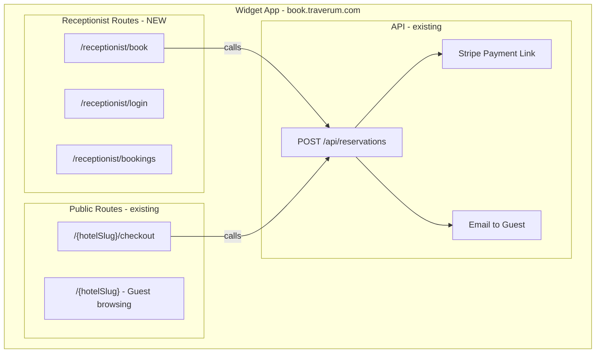
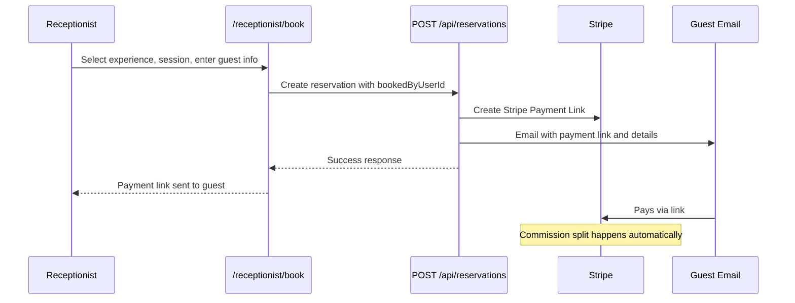

# Receptionist Tool Implementation Plan

Build a receptionist booking tool that lives in the widget app (`apps/widget` at `book.traverum.com/receptionist`). Receptionists can browse experiences near their hotel property, book for guests by entering their details, and a payment link gets emailed to the guest automatically. The tool reuses the existing booking API, Stripe, and email infrastructure. No connection to the dashboard is needed.

---

## Architecture Overview

## Booking Flow

---

## Phase 1: Database Migration

**New file:** `apps/dashboard/supabase/migrations/YYYYMMDD_receptionist_support.sql`

Changes to `hotel_configs` table:
- Add `address TEXT`
- Add `location geography(POINT, 4326)` with GIST index
- Add `location_radius_km INTEGER DEFAULT 25`
- Backfill from existing `partners` table data

Changes to `user_partners` table:
- Add `hotel_config_id UUID REFERENCES hotel_configs(id)` (links receptionist to specific property)
- Expand role CHECK constraint to include `'receptionist'`

Changes to `reservations` table:
- Add `booked_by_user_id UUID REFERENCES users(id)` (tracks who created the booking)

Update RLS policies so receptionists can read experiences/sessions/distributions but cannot write to anything except reservations.

**Dashboard code updates:**
- Update [LocationSettings.tsx](apps/dashboard/src/pages/hotel/LocationSettings.tsx) to read/write location from `hotel_configs` instead of `partners`
- Update [ExperienceSelection.tsx](apps/dashboard/src/pages/hotel/ExperienceSelection.tsx) to read location from `hotel_configs`
- Update Supabase types in both apps

---

## Phase 2: Widget Auth for Receptionist Routes

**Middleware** -- Update [middleware.ts](apps/widget/middleware.ts)
- Add `/receptionist/:path*` to the matcher
- Allow `/receptionist/login` through without auth (same pattern as `/dashboard/login`)

**Auth helper** -- New file: `apps/widget/src/lib/receptionist/auth.ts`
- `getReceptionistContext()` function (modeled after existing [getHotelContext](apps/widget/src/lib/dashboard/auth.ts))
- Looks up user via Supabase Auth
- Finds `user_partners` entry with `role = 'receptionist'`
- Resolves `hotel_config` from the membership's `hotel_config_id`
- Resolves `partner` (for hotel slug and Stripe account)
- Returns `{ user, partner, hotelConfig }` or redirects to login

---

## Phase 3: Receptionist Pages

All under `apps/widget/src/app/receptionist/`.

### Login page -- `receptionist/login/page.tsx`
- Email + password form (Supabase Auth)
- Branded as "Receptionist Portal"
- Redirect to `/receptionist/book` on success
- Reuse pattern from [dashboard login](apps/widget/src/app/dashboard/login/page.tsx)

### Protected layout -- `receptionist/(protected)/layout.tsx`
- Calls `getReceptionistContext()` to verify auth + role
- Minimal layout: header with hotel property name, two nav items ("Book" and "Bookings"), sign out button
- No sidebar, no settings, no analytics

### Book page (core feature) -- `receptionist/(protected)/book/page.tsx`
- Server component fetches hotel config (location, radius) and experiences within radius
- Client component (`BookClient.tsx`) handles the interactive flow:
  - **Two tabs:** "Selected" (hotel's chosen experiences, badged as recommended) and "All Nearby"
  - **Experience cards:** title, image, price, duration, supplier name, distance from hotel
  - **Click to expand:** description, photos, available sessions calendar
  - **Session picker:** available dates/times, or custom request option if experience `allows_requests`
  - **Participant count selector**
  - **Guest form:** name, email, phone
  - **Price summary** using existing `calculatePrice` from [pricing.ts](apps/widget/src/lib/pricing.ts)
  - **"Send Payment Link" button** calls `POST /api/reservations` with `bookedByUserId`
  - **Success state:** "Payment link sent to [email]"

### Bookings page -- `receptionist/(protected)/bookings/page.tsx`
- Lists reservations where `booked_by_user_id = current user`
- Joined with experiences, sessions, and bookings data
- Shows: guest name, experience title, date/time, status badge
- Filter by status (pending, approved, confirmed, completed)
- Click to expand: guest phone/email, supplier contact info, booking amount
- Read-only (no edit, cancel, or delete actions)

---

## Phase 4: API Modifications

### Update reservation endpoint -- [route.ts](apps/widget/src/app/api/reservations/route.ts)
- Accept optional `bookedByUserId` field in request body
- Store it in the `booked_by_user_id` column on the reservation
- Everything else (payment link creation, guest email, Stripe flow) works as-is

### Auto-create distribution
- When a receptionist books an experience that the hotel has not formally "selected" (no distribution record exists), auto-create a distribution with default commission rates (supplier 80%, platform 12%, hotel 8%)
- Add this check inside the reservation endpoint: if no distribution for this experience + hotel, insert one with defaults before proceeding
- This is needed because the Stripe webhook uses distributions to calculate commission splits

---

## Phase 5: Receptionist Account Setup (MVP)

No invitation system for MVP. Manual process:

1. Receptionist creates account at `/receptionist/login` (Supabase Auth signup)
2. Admin links them to the hotel property via SQL insert into `user_partners`
3. Receptionist logs in and sees their assigned property's experiences

Future: Add a "Team" page to the dashboard where hotel owners can invite receptionists.

---

## Files to Create

| File | Purpose |
|------|---------|
| `apps/dashboard/supabase/migrations/YYYYMMDD_receptionist_support.sql` | Migration: location on hotel_configs, receptionist role, booked_by |
| `apps/widget/src/lib/receptionist/auth.ts` | Auth helper for receptionist context |
| `apps/widget/src/app/receptionist/login/page.tsx` | Login page |
| `apps/widget/src/app/receptionist/(protected)/layout.tsx` | Protected layout with nav |
| `apps/widget/src/app/receptionist/(protected)/book/page.tsx` | Server wrapper for book page |
| `apps/widget/src/app/receptionist/(protected)/book/BookClient.tsx` | Client component: experience browser + booking form |
| `apps/widget/src/app/receptionist/(protected)/bookings/page.tsx` | Bookings list page |
| `apps/widget/src/components/receptionist/ExperienceCard.tsx` | Experience card component |
| `apps/widget/src/components/receptionist/BookingForm.tsx` | Guest details form + session picker |
| `apps/widget/src/components/receptionist/ReceptionistNav.tsx` | Header/nav component |

## Files to Edit

| File | Change |
|------|--------|
| [middleware.ts](apps/widget/middleware.ts) | Add `/receptionist` route protection |
| [route.ts](apps/widget/src/app/api/reservations/route.ts) | Accept `bookedByUserId`, auto-create distribution |
| [LocationSettings.tsx](apps/dashboard/src/pages/hotel/LocationSettings.tsx) | Read/write from `hotel_configs` instead of `partners` |
| [ExperienceSelection.tsx](apps/dashboard/src/pages/hotel/ExperienceSelection.tsx) | Read location from `hotel_configs` |
| Supabase types in both apps | Add new columns to type definitions |
