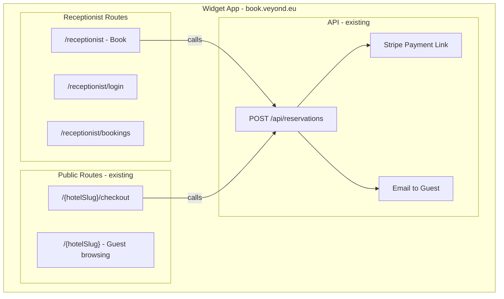
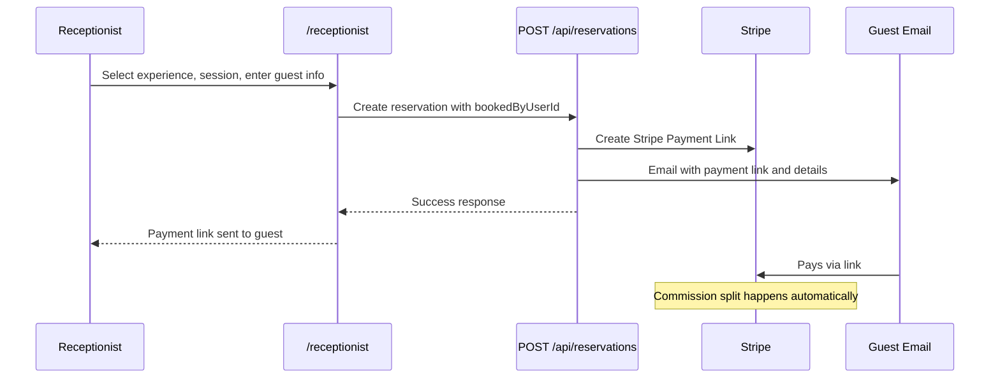

# Receptionist Tool — Purpose & Implementation

**Purpose doc and implementation reference for the hotel receptionist booking portal.**  
Live in the widget app at `book.veyond.eu/receptionist`. Receptionists book local experiences on behalf of guests; the guest receives a payment link by email and pays via Stripe. Same commission and booking engine as the guest-facing widget — no dashboard dependency.

---

## Purpose

Enable **hotel staff** to book **local experiences for guests** with minimal friction:

- **Zero handoff to the guest for browsing.** The receptionist chooses the experience and session, enters the guest’s details, and sends a payment link. The guest only pays (and optionally cancels via the link).
- **Same economics.** Every receptionist booking uses the same reservation → payment link → Stripe → commission split flow as a direct guest booking. The hotel earns its commission; the supplier gets paid; the platform takes its share.
- **Scoped to one property.** A receptionist is tied to a single hotel (via `user_partners.hotel_config_id`). They see only that property’s “selected” experiences and “nearby” experiences within the hotel’s radius.
- **Auditability.** Reservations store `booked_by_user_id` so we know which receptionist created each booking. The “Bookings” view is filtered to the current user’s bookings.

The tool does **not** replace the guest-facing widget: guests can still browse and book themselves. It adds a **staff path** for concierge-style booking when the guest prefers to book through the front desk.

---

## User Stories

1. **As a hotel receptionist**, I can log in and see my property’s name and a simple “Book” / “Bookings” nav so I know where I am and what I can do.

2. **As a receptionist**, I can see two lists of experiences:
   - **Recommended (Selected):** experiences my hotel has chosen to offer (from distributions). These are the ones we’re confident recommending.
   - **All Nearby:** every other active experience within the hotel’s location radius (from PostGIS), so I can still book something we haven’t “selected” if the guest asks.

3. **As a receptionist**, I can pick an experience, choose a session (or submit a custom request if the experience allows it), set participant count, enter the guest’s name, email, and phone, and send a payment link so the guest can pay without me handling payment or card data.

4. **As a receptionist**, I can see a list of bookings I created (filtered by `booked_by_user_id`), with guest name, experience, date/time, and status, so I can answer guest questions and follow up.

5. **As the platform**, we want every receptionist booking to flow through the same API, Stripe, and email pipeline as guest bookings so commission splits and supplier payouts are correct and no special cases creep in.

---

## What We Want It To Be

- **Simple.** No dashboard, no settings, no analytics. Login → Book or Bookings → done.
- **Fast.** Experience list and session availability should load quickly; the book flow should feel like a single form plus “Send payment link.”
- **Resilient to schema drift.** The same code runs against production and against Supabase branches (e.g. `receptionist-test`). Where the branch schema differs (e.g. no `partners.phone`, no `distributions.sort_order`), the app should still work (see “Implementation notes” below).
- **Secure.** Receptionist routes use Supabase Auth; server-side code uses the admin (service role) client only where necessary (e.g. fetching experiences). RLS still applies for non–service-role access.

---

## Architecture Overview



**Booking flow (receptionist path):**



---

## Implemented Routes & Structure

| URL | Purpose |
|-----|---------|
| `/receptionist/login` | Email + password (Supabase Auth). Redirect to `/receptionist` on success. |
| `/receptionist` | **Book** — main page: Recommended + All Nearby tabs, experience cards, session picker, guest form, “Send payment link”. |
| `/receptionist/bookings` | List of reservations where `booked_by_user_id = current user`. Read-only. |

**Auth:** `getReceptionistContext()` in `apps/widget/src/lib/receptionist/auth.ts` resolves the current user → `user_partners` (role `receptionist` or `owner`/`admin`) → `hotel_config` and `partner`. Protected layout and pages use this; missing or invalid context redirects to login or shows “Access Not Available”.

---

## Implementation Notes (What We Know Now)

These points matter for maintenance and for running the tool against a **Supabase branch** (e.g. `receptionist-test`).

### Experience data source

- **Selected (Recommended):** From `distributions` filtered by `hotel_config_id` (and fallback by `hotel_id` = hotel’s `partner_id` if the first query returns nothing). Nested select: `experiences ( *, partners (id, name, email) )`. We intentionally **omit `partners.phone`** in the select so branches that don’t have `partners.phone` don’t error; the UI still shows `supplier.phone` as `null` when absent.
- **Ordering:** We use `.order('id', { ascending: true })` on distributions. Branches may not have `distributions.sort_order`; ordering by `id` avoids “column does not exist” and is stable.
- **Response shape:** Supabase nested select returns the related experience under the table name `experiences` (and partner under `partners`). Code handles both `d.experiences` / `d.experience` and `exp.partners` / `exp.supplier` so it works with different PostgREST shapes.

### Nearby (All Nearby tab)

- **Source:** RPC `get_experiences_within_radius(hotel_location, radius_meters, exclude_partner_id)` (PostGIS). Excludes the hotel’s own partner so the hotel doesn’t see itself as a “nearby” supplier.
- **UI behaviour:** The "All Nearby" tab shows experiences within radius that are **not** in Recommended (no duplicates). If the hotel has distributions for every nearby experience, All Nearby is empty. The seed gives **only 4 distributions** so Recommended = 4 and All Nearby = 7.
- **Hotel location:** Must be set on `hotel_configs.location` (geography). Parsing supports:
  - WKT: `POINT(lng lat)` or `SRID=4326;POINT(...)`
  - GeoJSON object: `{ type: 'Point', coordinates: [lng, lat] }`
  - Stringified GeoJSON: `JSON.parse(location)` then `coordinates`
  - Fallback: two numbers in a string (e.g. `8.65, 45.95` or `45.95 8.65`), with lng/lat inferred by magnitude.
- If `location` is null or unparseable, Nearby returns an empty list (no crash).

### Env and branch testing

- When testing against a **Supabase branch**, the widget must use that branch’s **URL**, **anon key**, and **service role key** in `apps/widget/.env`. Using the main project’s service role key with a branch URL will cause “count 0” and no experiences, because the data lives on the branch.
- Receptionist experience fetching uses `createAdminClient()` (service role) so it can read distributions and call the RPC regardless of RLS.

### Receptionist account setup (MVP)

- No invitation UI. Manual: receptionist signs up at `/receptionist/login`; an admin (or script) inserts/updates `user_partners` with `role = 'receptionist'` and `hotel_config_id` for the correct hotel. See “Supabase branch for testing” below for the exact SQL pattern.

---

## Phases (Reference)

| Phase | Content |
|-------|--------|
| **1. Database** | `hotel_configs`: address, location (geography), location_radius_km. `user_partners`: hotel_config_id, role receptionist. `reservations`: booked_by_user_id. RLS for receptionist read/write. |
| **2. Auth** | Middleware for `/receptionist`, `getReceptionistContext()`, resolve hotel config and partner. |
| **3. Pages** | Login, protected layout with nav, Book page (tabs + form), Bookings list. |
| **4. API** | Reservation endpoint accepts `bookedByUserId`; optional auto-create distribution when receptionist books an experience the hotel hasn’t selected. |
| **5. Setup** | Manual link of user to hotel via `user_partners`. Future: Team page in dashboard for inviting receptionists. |

---

## Key Files

| File | Purpose |
|------|---------|
| `apps/widget/src/lib/receptionist/auth.ts` | `getReceptionistContext()` — user, partner, hotelConfig, userId. |
| `apps/widget/src/lib/receptionist/experiences.ts` | `getSelectedExperiences(hotelConfigId, hotelPartnerId?)`, `getNearbyExperiences(hotelConfig)` — used by Book page. |
| `apps/widget/src/app/receptionist/login/page.tsx` | Login form. |
| `apps/widget/src/app/receptionist/(protected)/layout.tsx` | Auth check, nav, “Access Not Available” states. |
| `apps/widget/src/app/receptionist/(protected)/page.tsx` | Book page (server): fetches selected + nearby, passes to BookClient. |
| `apps/widget/src/app/receptionist/(protected)/BookClient.tsx` | Tabs, cards, session picker, guest form, submit to POST /api/reservations. |
| `apps/widget/src/app/receptionist/(protected)/bookings/page.tsx` | Bookings list (server + client). |
| `apps/widget/src/app/api/reservations/route.ts` | Accepts `bookedByUserId`; optional auto-create distribution. |

---

## Supabase Branch for Testing

A dedicated branch keeps receptionist testing off production.

| | |
|--|--|
| **Branch name** | `receptionist-test` |
| **Project ref** | `jpntijqynbdjoxvxnahq` |
| **Dashboard** | [Supabase Dashboard](https://supabase.com/dashboard/project/jpntijqynbdjoxvxnahq) → branch **receptionist-test** |
| **API** | Use branch URL and keys from Project Settings → API. |

**Setup:**

1. **Migrations:** Bootstrap and later migrations are idempotent so they apply on an empty branch. Ensure **hotel_config_location_radius** (adds `hotel_configs.location`, `location_radius_km`) and **get_experiences_within_radius** RPC are applied. From `apps/dashboard`: `pnpm exec supabase link --project-ref jpntijqynbdjoxvxnahq`, then `pnpm exec supabase db push --linked`.
2. **Seed:** Run `apps/dashboard/supabase/seed.sql` in the branch SQL Editor. Creates Test Hotel, two suppliers (Test Supplier, Local Adventures Co), 11 experiences with locations near the hotel, sessions with `session_status = 'available'`, and **only 4 distributions** so "Recommended" has 4 items and "All Nearby" has 7. Also sets `user_partners` for the latest user as receptionist. **Widget must use the same Supabase project** (same branch URL/keys) to see both tabs. If you previously ran an older seed that added distributions for all 9 experiences, All Nearby will be empty; delete the extra distributions so only the first 4 experience IDs remain in `distributions` for Test Hotel, or re-seed on a fresh DB.
3. **Grant access to your user:** Run in branch SQL Editor (replace email):
   ```sql
   INSERT INTO user_partners (user_id, partner_id, role, hotel_config_id, is_default)
   SELECT u.id, p.id, 'receptionist', hc.id, true
   FROM users u, partners p, hotel_configs hc
   WHERE u.email = 'your@email.com' AND p.name = 'Test Hotel' AND hc.partner_id = p.id
   ON CONFLICT (user_id, partner_id) DO UPDATE SET role = 'receptionist', hotel_config_id = EXCLUDED.hotel_config_id, is_default = true;
   ```
4. **Widget env:** Set `NEXT_PUBLIC_SUPABASE_URL`, `NEXT_PUBLIC_SUPABASE_ANON_KEY`, and `SUPABASE_SERVICE_ROLE_KEY` in `apps/widget/.env` to the **branch** values. Restart the widget dev server.

**CLI (from repo root):**

```bash
cd apps/dashboard
pnpm exec supabase link --project-ref vwbxkkzzpacqzqvqxqvf   # main
pnpm exec supabase link --project-ref jpntijqynbdjoxvxnahq   # receptionist-test
```

**Copy production data to branch (for realistic testing):** To remove seed data and load production data (partners, experiences, sessions, etc.) into the branch, use the scripts in `apps/dashboard/supabase/scripts/`: run `clear-branch-data.sql` on the branch, then run `copy-production-to-branch.sh` (with `PRODUCTION_DATABASE_URL` and `BRANCH_DATABASE_URL` set). See `apps/dashboard/supabase/scripts/README.md`. After restore, sign up at the branch receptionist login and run the `user_partners` INSERT above (use a real hotel from the restored data) to link your user.

---

## Future

- **Team / invite:** Dashboard page for hotel owners to invite receptionists and assign them to a property (no manual SQL).
- **Optional refinements:** Export “my bookings”, simple filters by date range, or in-app copy of payment link for the receptionist to hand to the guest in person.
