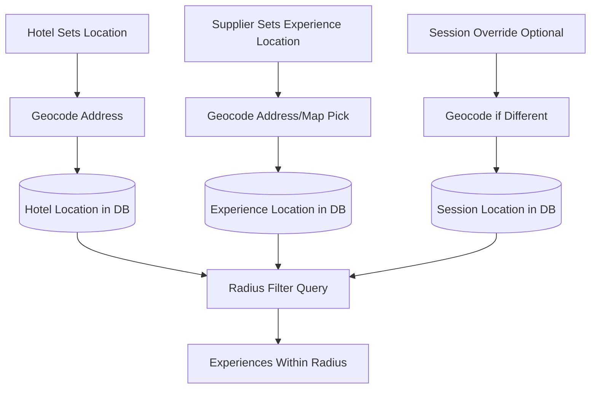

# Location System Implementation Plan

## Overview

Implement a location-based system using PostGIS to enable hotels to see and select experiences within a configurable radius. All experiences must have a location (suppliers operating in multiple areas create separate experiences).

## Architecture



## Database Schema Changes

### 1. Enable PostGIS Extension

- **File**: `apps/dashboard/supabase/migrations/[timestamp]_enable_postgis.sql`
- Enable PostGIS extension: `CREATE EXTENSION IF NOT EXISTS postgis;`

### 2. Add Location Fields to Partners Table

- **File**: `apps/dashboard/supabase/migrations/[timestamp]_add_partner_location.sql`
- Add columns:
  - `address` (text) - Full address string
  - `location` (geography(POINT, 4326)) - PostGIS geography point (lat/lng)
  - `location_radius_km` (integer) - Default: 25km, configurable per hotel
- Add GIST index on `location` for performance

### 3. Add Location Fields to Experiences Table

- **File**: `apps/dashboard/supabase/migrations/[timestamp]_add_experience_location.sql`
- Add columns:
  - `location_address` (text) - Address/meeting point description
  - `location` (geography(POINT, 4326)) - PostGIS geography point (mandatory)
- Add GIST index on `location`
- Add constraint: `location IS NOT NULL` (enforced after migration)

### 4. Add Location Fields to Experience Sessions Table

- **File**: `apps/dashboard/supabase/migrations/[timestamp]_add_session_location.sql`
- Add columns:
  - `location_address` (text, nullable) - Override address if different
  - `location` (geography(POINT, 4326), nullable) - Override location if different
- Add GIST index on `location`
- Logic: If session has location, use it; otherwise use experience location

## Geocoding Service Integration

### 1. Create Geocoding Utility

- **File**: `apps/dashboard/src/lib/geocoding.ts`
- **File**: `apps/widget/src/lib/geocoding.ts`
- Integrate with geocoding API (recommend Mapbox or Google Maps Geocoding API)
- Functions:
  - `geocodeAddress(address: string): Promise<{ lat: number, lng: number, formattedAddress: string }>`
  - `reverseGeocode(lat: number, lng: number): Promise<string>` (for map picker)
- Handle API errors and rate limiting
- Cache results to reduce API calls

### 2. Environment Variables

- Add geocoding API key to `.env` files
- `GEOCODING_API_KEY` (Mapbox or Google Maps)
- `GEOCODING_PROVIDER` ('mapbox' | 'google')

## Hotel Dashboard Changes

### 1. Hotel Location Settings Page

- **File**: `apps/dashboard/src/pages/hotel/LocationSettings.tsx` (new)
- **Route**: `/hotel/location`
- Features:
  - Address input field
  - Geocode on address entry (debounced)
  - Map display showing hotel location (optional, future enhancement)
  - Radius selector: Slider or input (5km - 100km, default 25km)
  - Save location and radius
  - Show current location on map if set

### 2. Update Experience Selection Query

- **File**: `apps/dashboard/src/pages/hotel/ExperienceSelection.tsx`
- Modify query to filter by radius:
  ```sql
  WHERE ST_DWithin(
    COALESCE(session.location, experience.location),
    hotel.location,
    hotel.location_radius_km * 1000  -- Convert km to meters
  )
  ```
- Show distance to each experience in the list
- Add "Distance" badge/meta info to experience cards

### 3. Update Navigation

- **File**: `apps/dashboard/src/components/layout/DashboardLayout.tsx`
- Add "Location Settings" link to hotel navigation

## Supplier Dashboard Changes

### 1. Update Experience Form

- **File**: `apps/dashboard/src/pages/supplier/ExperienceForm.tsx`
- Add location section:
  - Address input with autocomplete
  - "Pick on Map" button (opens map picker modal)
  - Map picker component (optional, can be future enhancement)
  - Display selected coordinates
  - Make location mandatory (validation)
  - Geocode address on save
  - Show error if geocoding fails

### 2. Location Picker Component (Future Enhancement)

- **File**: `apps/dashboard/src/components/LocationPicker.tsx` (new, optional for MVP)
- Interactive map for selecting location
- Reverse geocode selected point to show address

### 3. Update Experience Types

- **File**: `apps/dashboard/src/integrations/supabase/types.ts`
- **File**: `apps/widget/src/lib/supabase/types.ts`
- Add location fields to Experience type

## API/Backend Changes

### 1. Update Experience Selection API

- **File**: `apps/widget/src/app/api/dashboard/experiences/route.ts`
- Add radius filtering using PostGIS `ST_DWithin`
- Calculate and return distance for each experience

### 2. Geocoding API Endpoint (Optional)

- **File**: `apps/widget/src/app/api/geocode/route.ts` (new)
- Server-side geocoding endpoint to protect API keys
- Accept address, return coordinates
- Accept coordinates, return address (reverse geocode)

## Migration Strategy

### 1. Handle Existing Data

- **File**: `apps/dashboard/supabase/migrations/[timestamp]_migrate_existing_locations.sql`
- For existing experiences:
  - If `meeting_point` exists, attempt to geocode it
  - If geocoding fails, set a default location (city center based on supplier's city) or mark for manual review
- For existing hotels:
  - If `city` exists, geocode city center as default location
  - Set default radius to 25km

### 2. Data Validation

- Create migration to ensure all active experiences have location
- Mark experiences without location as requiring attention

## UI/UX Enhancements

### 1. Experience Selection Page

- Show distance badge: "2.5 km away"
- Sort by distance (closest first)
- Filter by distance range (future enhancement)
- Show map view of nearby experiences (future enhancement)

### 2. Experience Cards

- Add distance indicator
- Add location icon/marker
- Show "X km from your hotel" text

## Documentation Updates

### 1. Update Hotel Dashboard Docs

- **File**: `docs/apps/hotel-dashboard/pages/experience-selection.md`
- Add location filtering information
- Document radius selection

### 2. Create Location Settings Page Doc

- **File**: `docs/apps/hotel-dashboard/pages/location-settings.md` (new)
- Document hotel location setup

### 3. Update Experience Form Doc

- **File**: `docs/apps/supplier-dashboard/pages/experience-form.md`
- Add location field documentation
- Make location mandatory requirement clear

## Testing Considerations

1. Test PostGIS queries with various radius values
2. Test geocoding with international addresses
3. Test edge cases: experiences at exact radius boundary
4. Test performance with large number of experiences
5. Test session location override logic
6. Test migration of existing data

## Future Enhancements (Out of Scope)

- Interactive map view of experiences
- Multiple locations per experience (create separate experiences instead)
- Location-based sorting and filtering UI
- Distance-based pricing adjustments
- Location analytics (where bookings come from)

## Implementation Order

1. Database schema changes (PostGIS, columns, indexes)
2. Geocoding service integration
3. Hotel location settings page
4. Update experience selection with radius filtering
5. Supplier experience form location field
6. Migration of existing data
7. Documentation updates
8. Testing and validation

## Implementation Tasks

- [ ] Create migration to enable PostGIS extension in Supabase
- [ ] Add location fields (address, location geography, radius_km) to partners table with GIST index
- [ ] Add location fields (location_address, location geography) to experiences table with GIST index and NOT NULL constraint
- [ ] Add optional location override fields to experience_sessions table with GIST index
- [ ] Create geocoding utility library with Mapbox/Google Maps integration for address to coordinates conversion
- [ ] Create hotel location settings page with address input, geocoding, and radius selector
- [ ] Update experience selection query to filter by radius using PostGIS ST_DWithin and show distances
- [ ] Add mandatory location field to experience form with address input and geocoding
- [ ] Create migration to geocode existing meeting_point addresses and set default hotel locations
- [ ] Update TypeScript types to include new location fields in experiences, partners, and sessions
- [ ] Update hotel and supplier dashboard documentation to include location system information
